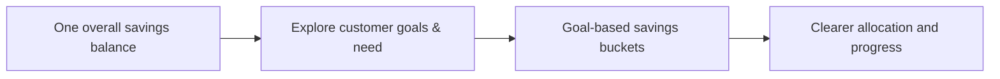
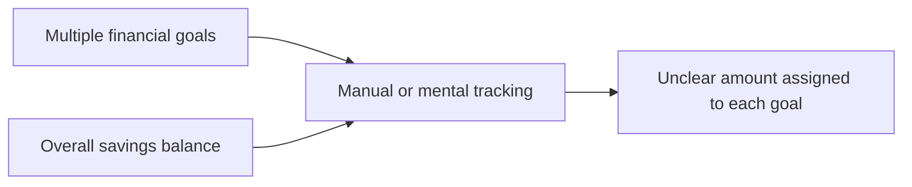
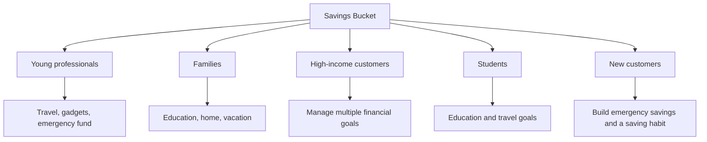
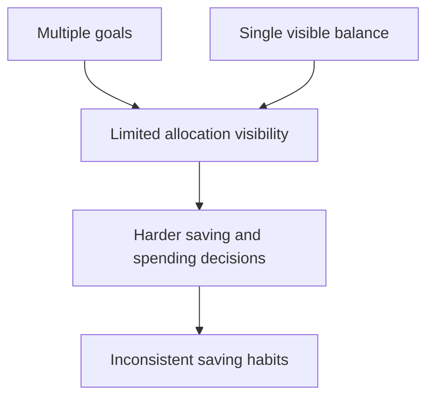
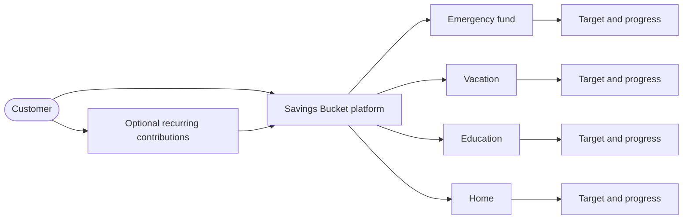
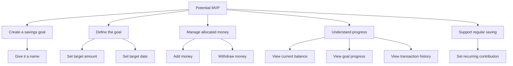
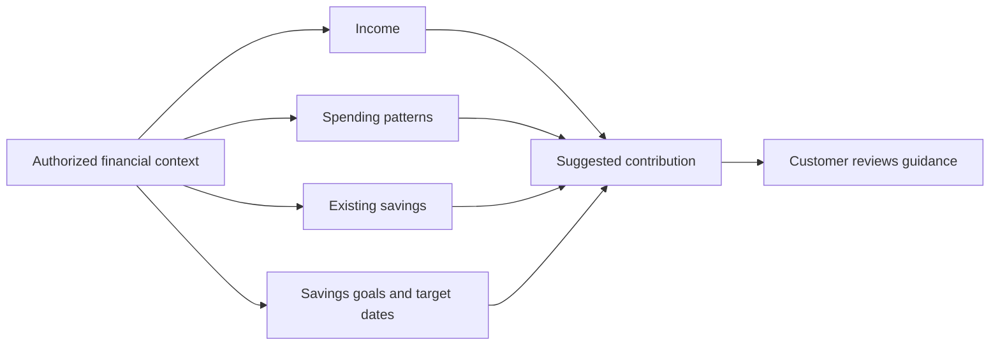
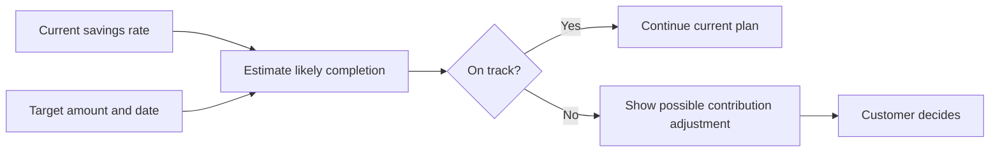
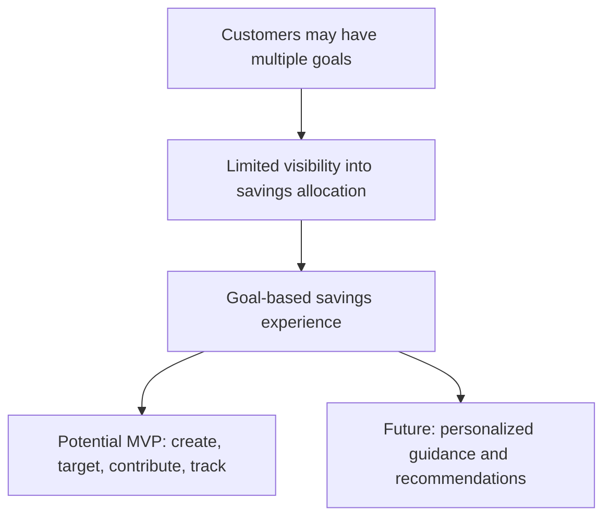
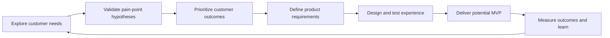

# Savings Bucket

## Product Discovery

| Field | Value |
| --- | --- |
| Domain | Digital Banking / Personal Finance |
| Status | Draft - Discovery Phase |
| Version | 1.0 |
| Date | 31 August 2026 |

## 1. Executive Summary

Savings Bucket explores how a digital banking platform can help customers organize savings around specific financial goals. Customers may be saving for an emergency fund, a vacation, a vehicle, education, or a home, but a traditional account typically presents one overall balance without showing how much is intended for each goal.

The concept is to let customers create multiple goal-based buckets, allocate savings to them, track progress, and optionally automate contributions.

### Discovery Objective

Explore and define a digital savings-bucket experience that enables customers to create, organize, track, and contribute toward multiple financial goals within their banking experience.

## 2. Problem Statement

Customers often have multiple financial goals but lack an intuitive mechanism to separate and track savings against those goals. This can make it difficult to understand progress, maintain savings discipline, and determine whether they are on track to achieve their objectives.

### Current-State Observation

Customers may be able to see their total savings, but not the intended allocation of that balance across individual goals.

## 3. Target Users

These are initial potential customer segments to explore, not validated personas.

| Potential segment | Goals or needs to explore |
| --- | --- |
| Young professionals | Travel, gadgets, emergency fund |
| Families | Education, home, vacation |
| High-income customers | Multiple financial goals |
| Students | Education and travel goals |
| New customers | Build emergency savings and develop a saving habit |

## 4. Pain-Point Hypotheses

The following are discovery hypotheses to validate with customers:

| Hypothesis | Possible customer impact |
| --- | --- |
| It is difficult to track multiple financial goals | Customers may not know how much is available for each objective |
| Goal progress is not clearly visible | Customers may not know whether they are on track |
| Money intended for one goal may be spent on another | Important goals may be underfunded |
| It is difficult to determine how much to save | Customers may delay or undershoot contributions |
| Manual tracking is inconvenient | Customers may stop keeping their allocations current |
| Personalized savings guidance is missing | Customers may lack a practical next step |
| Customers may find it difficult to stay disciplined | Saving may be inconsistent |

## 5. Potential Future State

The proposed experience would help customers organize savings around specific goals, monitor progress toward each goal, and optionally make recurring contributions.

### Expected Experience Shift

| Current state | Potential future state |
| --- | --- |
| One overall balance | Savings organized around individual goals |
| Mental or manual allocation | Visible saved amount for each goal |
| Progress is difficult to understand | Target, date, remaining amount, and progress are shown |
| Contributions require repeated manual effort | Optional recurring contributions support consistency |

## 6. Potential MVP

The potential MVP focuses on core goal-based savings capabilities. Scope should be confirmed through product definition and implementation planning.

Potential MVP capabilities:

1. Create a savings goal or bucket.
2. Give the goal a name.
3. Set a target amount.
4. Set a target date.
5. Add money to the bucket.
6. Withdraw money from the bucket.
7. View the current balance.
8. View goal progress.
9. View transaction history.
10. Set a recurring contribution.

## 7. Advanced Feature Opportunities

These capabilities are opportunities beyond the core potential MVP.

### 7.1 Personalized Savings Recommendation

The system could analyze relevant, appropriately authorized information such as income, spending patterns, existing savings, savings goals, and target dates to provide personalized savings recommendations.

> “Based on your current savings pattern, contributing ₹7,500 per month could help you reach your vacation goal within your target timeframe.”

### 7.2 Intelligent Goal Adjustment

The system could identify when a customer may not reach a goal by its target date and suggest possible adjustments.

> “You currently save ₹5,000 per month. At this rate you'll reach your ₹1,00,000 vacation goal in 20 months. Increasing your monthly contribution to ₹7,500 would help you reach it in approximately 14 months.”

### 7.3 Smart Bucket Recommendation

The system could recommend potential savings goals based on relevant customer financial patterns.

| Example recommendation | Example value |
| --- | --- |
| Goal | Emergency Fund |
| Recommended target | ₹2,00,000 |
| Current savings | ₹80,000 |
| Recommended monthly contribution | ₹10,000 |

## 8. Discovery Summary

Key takeaways:

- Customers may have multiple financial goals but limited visibility into how savings are allocated across them.
- A goal-based savings experience could help customers organize, track, and manage savings for different objectives.
- The potential MVP centers on creating goals, setting targets and dates, contributing funds, tracking progress, viewing transactions, and setting recurring contributions.
- Advanced opportunities include personalized savings recommendations, intelligent goal adjustments, and smart bucket recommendations.

## 9. Questions For Further Discovery

The source discovery brief identifies opportunity areas but does not include validated research findings. Useful follow-up questions include:

- How do customers currently track money intended for different goals?
- Which goals are most important to each customer segment?
- What makes it hard to keep savings allocations up to date?
- What progress information would help customers decide what to do next?
- How much control do customers expect over withdrawing allocated savings?
- Which recurring contribution controls are essential for customers?
- What level of explanation and control would customers expect from recommendations?

## 10. Discovery-to-Product Path

The next product-definition step is to validate the hypotheses, prioritize the customer outcomes, and use the findings to finalize MVP requirements.