# Savings Bucket

## Product Requirements Document

| Field | Value |
| --- | --- |
| Domain | Digital Banking / Personal Finance |
| Status | Draft - Product Definition |
| Version | 1.0 |
| Date | 2 September 2026 |

## 1. Product At A Glance

Savings Bucket helps customers organize, grow, and track money against multiple financial goals inside their banking experience.

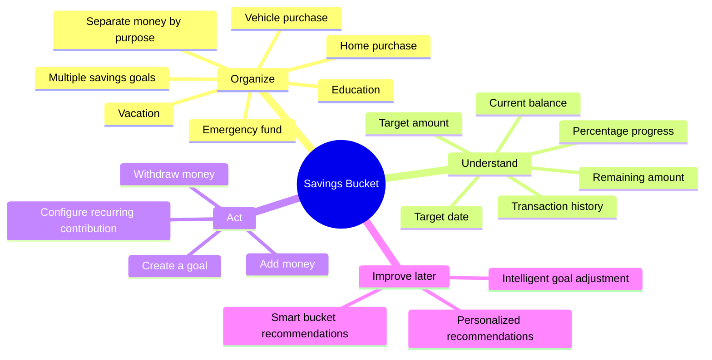

## 2. Product Vision

> Enable customers to organize, track, and grow their savings around the financial goals that matter to them.

The experience should make saving:

- **Structured:** organize savings by goal.
- **Visible:** make progress easy to see.
- **Goal-oriented:** give every bucket a target.
- **Convenient:** contribute and withdraw money easily.
- **Disciplined:** support consistent saving habits through recurring contributions.

## 3. Customer Problem And Opportunity

Customers often need to mentally or manually track which part of their overall savings is intended for each goal. This makes progress difficult to understand and can make it easier to use money intended for one objective for another purpose.

Savings Bucket creates a clear relationship between:

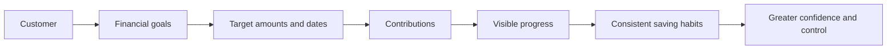

## 4. Core Product Flow

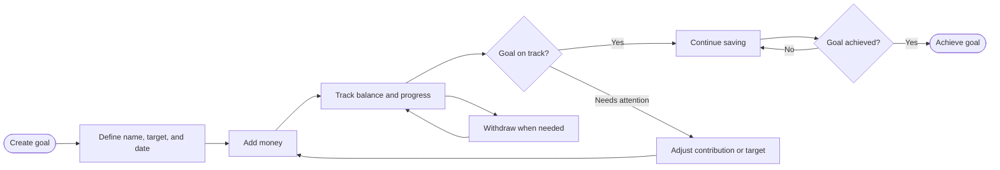

### Example Goal

| Detail | Example |
| --- | --- |
| Goal | Europe Vacation |
| Target | ₹1,50,000 |
| Saved | ₹75,000 |
| Remaining | ₹75,000 |
| Progress | 50% |
| Target date | June 2027 |
| Monthly contribution | ₹10,000 |

## 5. MVP Scope

### In Scope

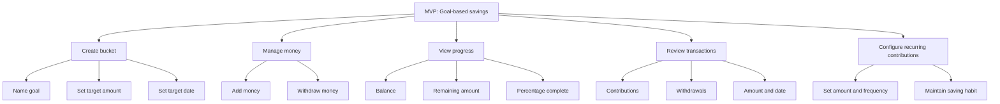

### Out Of Scope For MVP

- Personalized savings recommendations.
- Intelligent goal adjustment.
- Smart bucket recommendations.
- Guaranteed financial outcomes or financial advice.
- Final decisions about unlimited buckets, goal completion behavior, or post-completion money handling.

## 6. Functional Requirements

| ID | Requirement | Priority | Acceptance signal |
| --- | --- | --- | --- |
| FR-001 | Customer can create a savings bucket | Must Have | A new goal is created and shown in the dashboard |
| FR-002 | Customer can name the bucket | Must Have | The goal name is visible in bucket and detail views |
| FR-003 | Customer can set a target amount | Must Have | Target amount is stored and displayed |
| FR-004 | Customer can set a target date | Must Have | Target date is stored and displayed |
| FR-005 | Customer can add money to a bucket | Must Have | Balance and transaction history are updated |
| FR-006 | Customer can withdraw money | Must Have | Balance, progress, and transaction history are updated |
| FR-007 | Customer can view current bucket balance | Must Have | Current saved amount is visible per goal |
| FR-008 | Customer can view goal progress | Must Have | Target, saved, remaining, and percentage are visible |
| FR-009 | Customer can view transaction history | Must Have | Contributions and withdrawals show amount and date |
| FR-010 | Customer can configure recurring contribution | Must Have | Customer can create and manage a recurring schedule |

## 7. User Journeys

### 7.1 Create A Goal

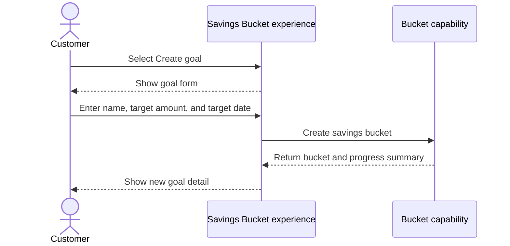

### 7.2 Add Money

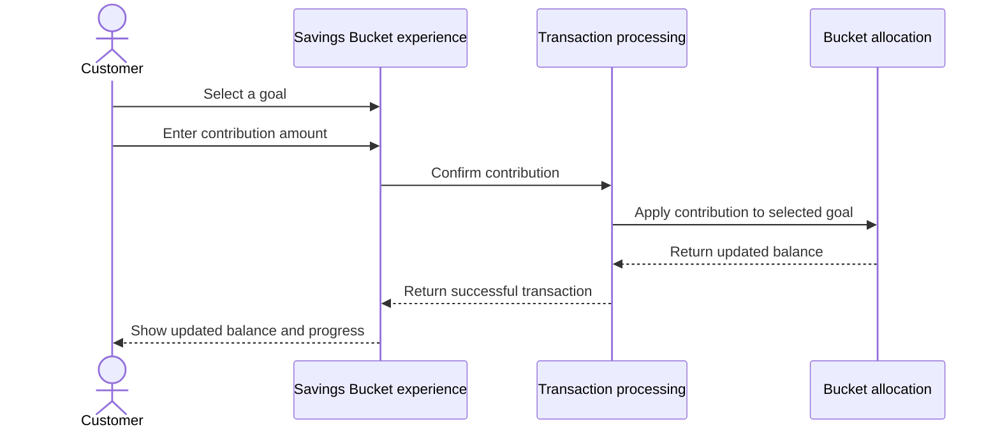

### 7.3 Withdraw Money

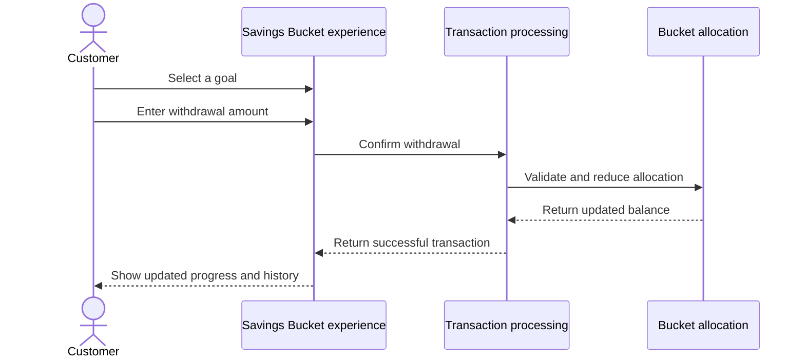

### 7.4 Recurring Contribution

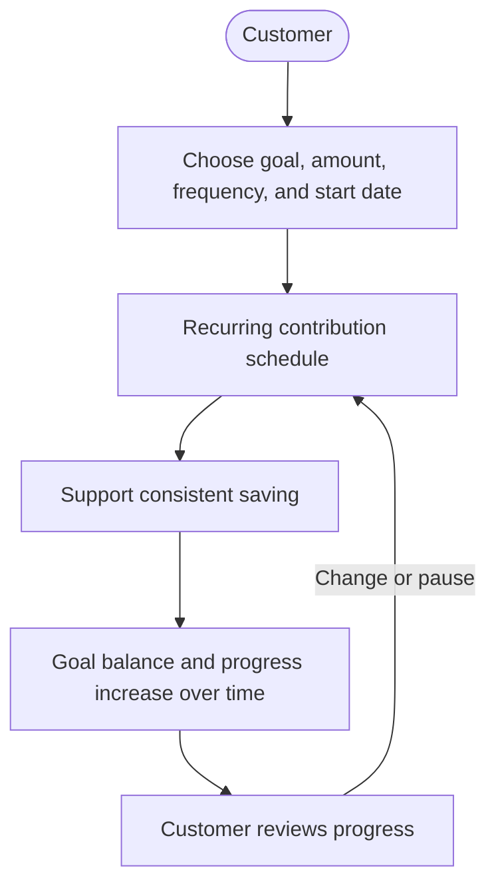

## 8. Information Model

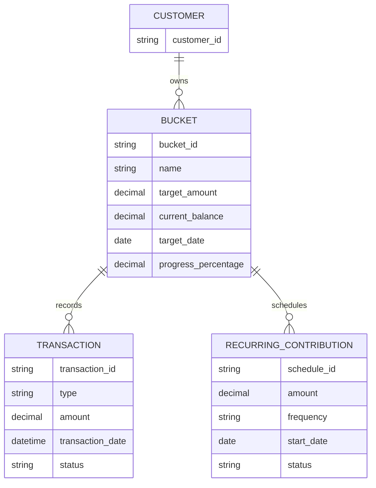

## 9. Product Behavior And Rules

### Balance And Progress

For each bucket, the product should show:

```text
Remaining amount = max(target amount - current saved amount, 0)
Progress percentage = min(current saved amount / target amount * 100, 100)
```

The balance, transaction history, and progress must remain consistent after every successful contribution or withdrawal.

### Money Movement Rules

- A customer selects the target bucket before adding or withdrawing money.
- A successful contribution increases the selected bucket balance.
- A successful withdrawal decreases the selected bucket balance.
- Every contribution and withdrawal is recorded in transaction history.
- Duplicate credits or deductions must be prevented.
- Failed transactions must not partially update the bucket balance.
- The product must clearly communicate successful and failed actions.

## 10. Non-Functional Requirements

| Quality area | Requirement |
| --- | --- |
| Performance | Dashboard and post-transaction balance updates should respond within an acceptable time under normal conditions. |
| Availability | Capability should align with the bank's digital banking availability targets. |
| Reliability | Balances, transactions, and progress must remain consistent. |
| Security | Only authenticated and authorized customers can access their own buckets. |
| Scalability | Support growth in customers, buckets, and transactions. |
| Auditability | Contributions, withdrawals, and important bucket actions must be traceable. |
| Usability | Customers should understand and manage goals without financial expertise. |
| Accessibility | Balance, progress, target, date, and key actions must work with supported assistive technologies. |
| Privacy | Financial information and future recommendation inputs must be handled according to applicable privacy and banking requirements. |

## 11. Security And Trust Boundaries

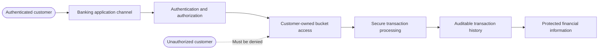

Security expectations:

- Customers must only view and manage their own buckets.
- Financial information must be protected during storage and transmission.
- Financial transactions must follow existing bank authentication and security controls.
- Future recommendation features must use only appropriately authorized customer information.
- Recommendations must be presented as guidance, not guaranteed outcomes.

## 12. Future Product Evolution

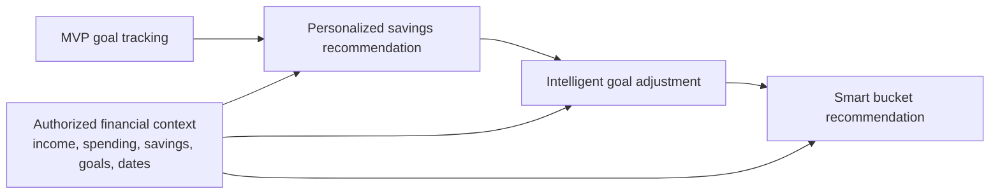

### 12.1 Personalized Savings Recommendation

Use authorized information such as income, spending patterns, existing savings, goals, and target dates to suggest a contribution amount.

Example: “Based on your current savings pattern, contributing ₹7,500 per month could help you reach your vacation goal within your target timeframe.”

### 12.2 Intelligent Goal Adjustment

Explain the relationship between current contribution, target amount, target date, and required contribution. The product may suggest a revised contribution when the customer is unlikely to reach a goal on time.

### 12.3 Smart Bucket Recommendation

Suggest potential goals and targets, such as an emergency fund, based on appropriately authorized financial patterns. This remains a future opportunity and is not mandatory for MVP.

## 13. Success Indicators

The product should help customers:

- Organize savings around multiple goals.
- Understand progress more clearly.
- Track individual financial objectives.
- Maintain consistent saving behavior.
- Increase engagement with goal-based saving.

## 14. Assumptions

1. Customers have multiple financial goals.
2. Customers benefit from separating savings by goal.
3. Customers value visible progress.
4. Customers will use recurring contributions.
5. Personalized recommendations could provide additional value in future phases.

## 15. Dependencies

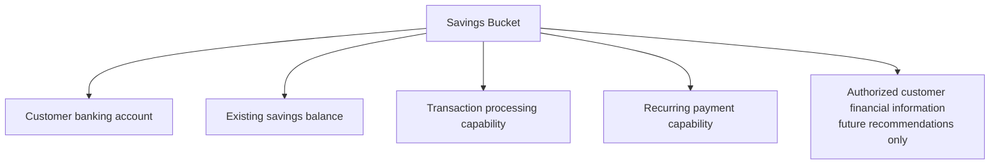

## 16. Open Questions

| # | Decision needed |
| --- | --- |
| 1 | Can customers create unlimited buckets? |
| 2 | Is there a minimum or maximum target amount? |
| 3 | Can customers rename or delete a bucket? |
| 4 | What happens when a customer withdraws money from a bucket? |
| 5 | Can a customer pause or modify recurring contributions? |
| 6 | What happens when the target date is reached? |
| 7 | Can a customer contribute to multiple buckets from the same account? |
| 8 | Should customers receive notifications about goal progress? |
| 9 | Should the system automatically suggest target amounts? |
| 10 | How should personalized recommendations be presented? |
| 11 | Should customers be able to mark a goal as completed? |
| 12 | What happens to money after a goal is completed? |

## 17. Risks And Mitigations

| Risk | Potential impact | Product response |
| --- | --- | --- |
| Customers may not understand the bucket concept | Low adoption | Use clear labels, balances, examples, and progress language. |
| Too many buckets may create complexity | Poor user experience | Define bucket limits and keep the dashboard scannable. |
| Customers may withdraw frequently | Goals may not be achieved | Show withdrawal impact on progress and remaining amount. |
| Recommendations may be inaccurate | Loss of customer trust | Keep recommendations advisory and explain assumptions. |
| Customers may not configure recurring contributions | Limited saving discipline | Make recurring setup easy and visible in goal detail. |

## 18. MVP Acceptance Checklist

- [ ] Customer can create a savings bucket.
- [ ] Customer can provide a goal name.
- [ ] Customer can define a target amount.
- [ ] Customer can define a target date.
- [ ] Customer can add money.
- [ ] Customer can withdraw money.
- [ ] Customer can view current balance.
- [ ] Customer can view goal progress.
- [ ] Customer can view transaction history.
- [ ] Customer can configure recurring contributions.

## 19. Product Summary

Savings Bucket gives customers a structured way to organize and manage savings against multiple financial goals. The MVP focuses on the complete loop:

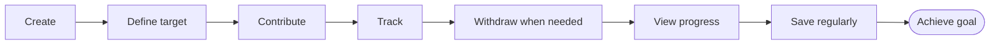

The product can later evolve into a more personalized savings capability, while keeping recommendations advisory and preserving customer control over financial decisions.