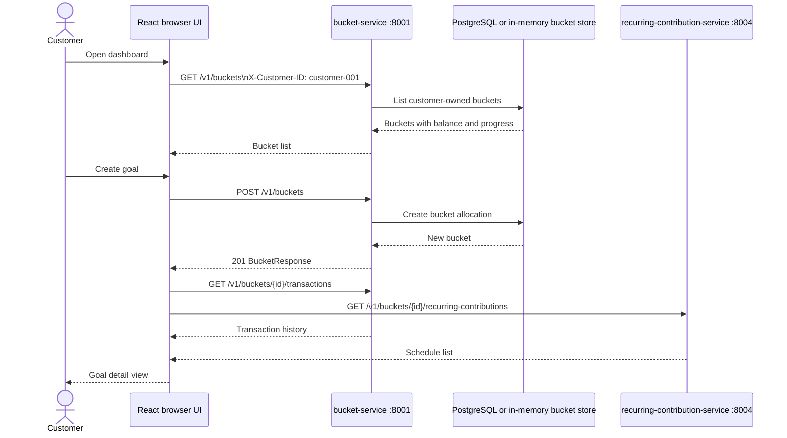
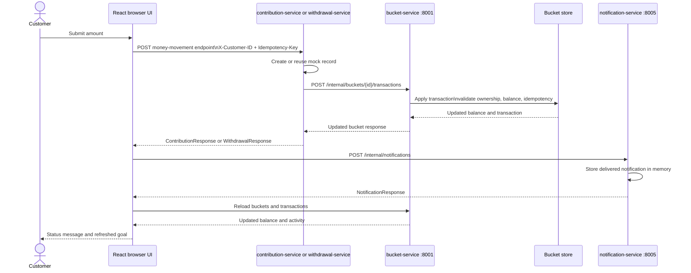
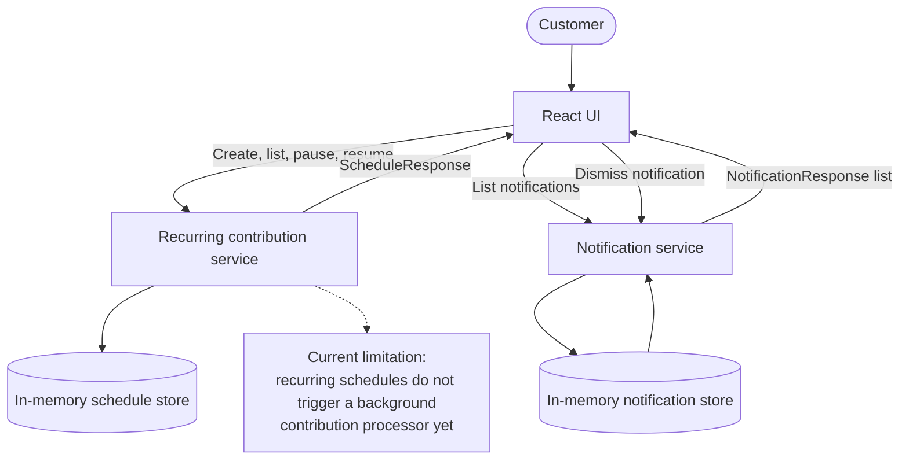

# Savings Bucket: Current Architecture and User Flow

This diagram reflects the implemented local mock-first flow in the repository. It does not represent the planned production API Gateway, OIDC/JWT, banking, EventBridge, or SQS components.

## Current local architecture

```mermaid
flowchart LR
    customer([Customer])
    browser[React + TypeScript + Vite\nBrowser UI\ncustomer-001]

    subgraph compose[Docker Compose local environment]
        bucket[Bucket service\nFastAPI :8001\nBuckets + allocation state]
        contribution[Contribution service\nFastAPI :8002\nMock contribution records]
        withdrawal[Withdrawal service\nFastAPI :8003\nMock withdrawal records]
        recurring[Recurring contribution service\nFastAPI :8004\nMock schedules]
        notification[Notification service\nFastAPI :8005\nIn-memory notifications]
        postgres[(PostgreSQL 16\nsavings_bucket\n:5432)]
    end

    customer --> browser
    browser -->|GET/POST /v1/buckets\nGET transactions| bucket
    browser -->|POST/GET /v1/buckets/{id}/contributions| contribution
    browser -->|POST/GET /v1/buckets/{id}/withdrawals| withdrawal
    browser -->|POST/GET/PATCH recurring-contributions| recurring
    browser -->|GET/DELETE notifications\nPOST internal notification| notification

    contribution -.->|POST /internal/buckets/{id}/transactions| bucket
    withdrawal -.->|POST /internal/buckets/{id}/transactions| bucket

    bucket -->|PostgresBucketStore\nwhen DATABASE_URL is configured| postgres
    bucket -.->|InMemoryBucketStore\nwhen DATABASE_URL is absent| bucketMemory[(Process memory)]
    contribution --> contributionMemory[(Process memory)]
    withdrawal --> withdrawalMemory[(Process memory)]
    recurring --> recurringMemory[(Process memory)]
    notification --> notificationMemory[(Process memory)]

    classDef user fill:#f4efe6,stroke:#a56b2b,color:#2f241a,stroke-width:2px
    classDef service fill:#e7f2ef,stroke:#23766b,color:#163c37,stroke-width:1.5px
    classDef data fill:#fff7d6,stroke:#b58a22,color:#4a3b08,stroke-width:1.5px
    classDef future fill:#eeeeee,stroke:#999999,color:#555555
    class customer,browser user
    class bucket,contribution,withdrawal,recurring,notification service
    class postgres,bucketMemory,contributionMemory,withdrawalMemory,recurringMemory,notificationMemory data
```

## User flow: create and inspect a goal



## User flow: contribution or withdrawal



## User flow: recurring contributions and notifications



## Implemented versus planned

| Area | Current local behavior | Planned production boundary |
| --- | --- | --- |
| Identity | `X-Customer-ID` header | OIDC/JWT validation |
| Client routing | Browser calls each service directly | API Gateway boundary |
| Money movement | Mock records and mock banking mode | Banking transaction service and provider adapter |
| Bucket persistence | PostgreSQL when configured, otherwise memory | Durable service-owned persistence |
| Other service records | In-memory stores | Durable stores and event-driven processing |
| Recurring execution | Schedule CRUD only | EventBridge/SQS worker flow |
| Notifications | Local delivered result in memory | Notification delivery provider |